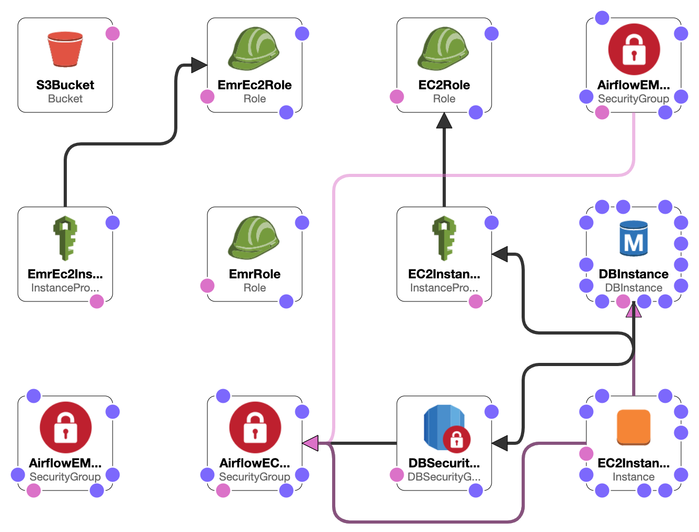

#Data Engineering Capstone Project

##Project Summary
Every year USA attracts lot of visitors who come here for business, tourism and as students. These are Non-immigrants visitors.
In this project I am trying to gather the data to get an insight on these travelers. An analyst can use this data to analyze where the visitors travel from? and to which cities? what is the demographics of these cities?
The monthly average temperatures of these cities. The type of travellers and where they visit.

The scope of the project is to demonstrate the use of Data Engineering technologies that can scale with data. Data is an important
factor for this project. We are going to use following Data sources:
The following data set is combined and transformed to the fact and dimensional data and stored on S3.

- I94 Immigration Data: This data comes from the US National Tourism and Trade Office. [This](https://travel.trade.gov/research/reports/i94/historical/2016.html) is where the data comes from. Udacity provided the dataset for the year 2016 and along with a data dictionary. I have uploaded the sample data file to the GitHub.
- World Temperature Data: This dataset came from Kaggle. You can read more about it [here](https://www.kaggle.com/berkeleyearth/climate-change-earth-surface-temperature-data).
- U.S. City Demographic Data: This data comes from OpenSoft. You can read more about it [here](https://public.opendatasoft.com/explore/dataset/us-cities-demographics/export/).
- Airport Code Table: This is a simple table of airport codes and corresponding cities. It comes from [here](https://datahub.io/core/airport-codes#data). 

To achieve this we will use AWS EMR, Apache airflow, Apache Livy and Pyspark. 

##AWS setup
For AWS cloud set up we are going to use cloud formation script. 
The script will create a stack depicted in the picture below. 
This consists ofthe EC2 instance, S3, IAM roles and the DBinstance for airflow

To create stack login to AWS go to cloudformation -> create stack -> select the from template, choose the file cloudformation/cloudformation.yaml.
Click next, provide the stack name, DBpassword, select the key-pair. If you don't have one you haveto create one before. Give the name of s3 bucket.

###Gathering the data:

The immigration data for year 2016 was provided by udacity, along with data sets like global temperature by cities,
all airport codes and the USA city demographics. Udacity also provided a data dictionary file for immigration. which we have split to multiple files.

- i94addrl.txt
- i94cntyl.txt
- i94model.txt
- i94prtl.txt

All this data are uploaded to the S3 bucket under key - data/raw by a python script dataupload_udacity_s3.py. dl.cfg file will contain the aws key and secret.

The above mentioned cloudformation script creates a ec2 instance with airflow installed and running.
We have to start the airflow scheduler by logging in to EC2 machine. Turn on the cluster.dag.

The cluster_dag creates the EMR cluster to perform the spark. This dag is scheduled to run monthly. For the purpose of this demonstration dag backfills the data from 2016-01-01 to 2016-04-01.
But can be configured by changing start_date, end_date and the schedule interval if needs to change the frequency. 
The dag creates cluster and waits for cluster to be available. 
Once cluster is available, airflow can execute ETL tasks.

###Data Model

###Steps to execute this project

- The stack is created on AWS using the cloud formation script.
- The immigration data provided by the Udacity is uploaded to the S3 using the script dataupload_udacity_s3.py
- Log into the EC2 instance and start the airflow schduler.
- Open airflow ui interface and turn on the cluster_dag. This job is scheduled to run once a month.
- Once airflow workflow is complete. The data lake is available on the S3 bucket.

